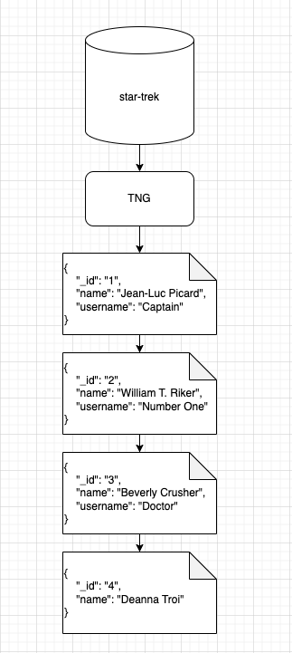
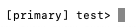
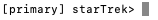

# An Introduction to MongoDB

This talk is going to assume you have the following installed:

- [Visual Studio Code](https://code.visualstudio.com/)
- [Node.js](https://nodejs.org/en)
- [MongoDB Atlas](https://www.mongodb.com/products/platform/cloud)

## Overview

Okie dokie artichokes, let's come together and talk about MongoDB. This talk will cover the following:

- Databases
    - NoSQL and SQL databases
    - MongoDB
        - Collections
        - Documents
        - BSON
- CRUD
    - Create a document
    - Read all documents
    - Read a single document
    - Update mulitple documents
    - Update a single document
    - Delete multiple documents
    - Delete a single document
- Seeding a database

## Databases

Databases are an organized collection of data that is stored either locally or remotely. They are designed to efficiently manage, store, retrieve, and manipulate data for whatever purpose we need. Think of a social media site. A database is a fundamental part of that site. We need to manange, store, and retrieve any posts the user makes.

Characteristics of a database include (but not limited to):

- Data Structure - Data is organized in some format. Databases structure will very between different database solutions.
- Data Relationships - Data can be related to each other in some way. Using the social media example a User (single database entry) can have a Profile (seperate database entry). In this example the User can have a Profile resulting in a one to one relationship.
- Query Language - A way to interact with the Database. Functions and methods that allow us to retrieve, insert, update, and delete data entries.

A couple of database types include (but not limited to):

- Relational Database - MySQL, PostgreSQL, Oracle.
- NoSQL Database - MongoDB.
- NewSQL Database - Google Spanner, CockroachDB.
- In-Memory Database - Redis, Memcached.
- Time-Series Database - InfluxDB, Prometheus.

## SQL Databases

SQL databases are a relational database which represents it's data in a table with rows and columnns. SQL tables are a two dimensinal structure consisting of rows and columns. Each table represents a specific enity, while each row is a seprate data entry. Columns, in this structure, represent a specific attribute of data.

Let's us the social media example again. As a user on a socail media site they can make a profile that contains the users name and username. The profile would be a table, the user who created a profile would be a single row in the profile table, and the name and username would be indvidual columns. 

**Profile Table**

| PK | name             | username   |
| -- | ---------------- | ---------- |
| 1  | Jean-Luc Picard  | Captain    |
| 2  | William T. Riker | Number One |
| 3  | Beverly Crusher  | Doctor     |
| 4  | Deanna Troi      | NULL       |

Notice that there is a column that was not mentioned, `PK`. Every data entry to a SQL database will be given a primary key or `PK`. We can use the primary key to interact with a specific data entity, this can take the form of reading, updating, or deleting that data entity.

With the table structure we are reinforcing that every data enity will have the same keys or fields. In the example above if we were to add another row (data entry) that entry would have a name and a username property.

## NoSQL Database

Not Only SQL or NoSQL database is a database management system for managing data that doesn't fit neatly into a relational database or a SQL database. NoSQL databases are known for their flexibilty, scalability, and ability to handle unstructured data. The key word here is unstructured. In the above section we can see an example of a SQL table. It's structure is predefined. Every entry has a `pk`, `name`, and `username`. Those field might hold `null` values but they are still there. In NoSQL we do not need to have a predefined structure and any `null` field we might have could just be left off. 

There are a couple of data models for NoSQL databases:

- Graph - Represents data as a graph. This makes it ideal for applications that have complex relationships or have network like structures.
- Column-family stores - Mimics almost a SQL structure with data being housed in columns.
- Key-Value stores - Data is represented as key/value pairs.
- Documents stores - Data is stored in a semi-structed document. This is either JSON or BSON.

**Profile Collection**

```bson
{
    "_id": "1",
    "name": "Jean-Luc Picard",
    "username": "Captain"
},
{
    "_id": "2",
    "name": "William T. Riker",
    "username": "Number One"
},
{
    "_id": "3",
    "name": "Beverly Crusher",
    "username": "Doctor"
},
{
    "_id": "4",
    "name": "Deanna Troi"
}
```

This structure is what a document stores NoSQL structure would look like. Instead of a table we have a collection. This collection contains BSON objects. Notice that the last object here is missing the `username` key/value pair. This is ok and intentional. Since we are using a NoSQL database we do not have to follow a predefined structure.

## MongoDB

MongoDB is a document-orientented (document stores mentionded above) database. Documents are stored as BSON objects, which are flexible schema-less. These documents are contained within a collection. While the data contained in the documents might differ the collection should contain documents that have a similar or related purpose.




Let's go back to that social media profile example again. Here is a overview of what this would look like modeled using MongoDB

- `social-media-app-name` - This is the database. All collections are contained in the database and it's normally named after the application you are creating.
- `profiles` - This is the collections. Collections contain related or semi related data. Usualy lowercase and a pularl of what you are containing. Since these profile documents in this collection the collection name is `profiles`.
- The documents are stored in a collection. These are BSON document that contain field/value pairs.

### Connection to Atlas

TODO: update this to use the shell and load()

If you have not already done so follow the instructions [here](https://www.mongodb.com/docs/atlas/driver-connection/#connect-your-application) to obtain your connection string and allow access from your IP address. We will be connecting to your database online.

Once you have completed the steps from the documentation above:

- Create a `.env` file located at the root of this repository
- Inside that file create a new enviromental variable called `URI`
- Place your connections string as the value of the `URI` variable
- Test your connection by running the connection file with Node -> `node config/connection.js`

If successful you will see `Successfully connected to Atlas` in your console.

### We do: Databases and Collections

The following exercises are going to be done using the `mongosh`. Use the above instructions to connect to your Atlas Cloud MongoDB account.

A database in MongoDB can hold one or more collections. By default if a database is not provided when entering the shell your database will be `test`.



Notice above how the shell says `test>`. This indicates that we are connected to the `test` database. This database is a catch all for MongoDB interations, if you would like to test some collection/document ideas here is the perfect place to do that before creating another database.

In development you want to make sure that you create a new database for each project. Rember that a database can contain many collections. To create a database we can either write a script or type directly into the shell. For this lesson we will be doing a mix of both.

First lets create a script to be ran. Inside of your shell:

```bash
use starTrek
```

- `use` - MongoDB shell command used to use a database. This database can now be refered to in the `db` variable, we will see this soon. If the database has not been created this command will also create it.
- `starTrek` - Name of the database we want to create. Convention is to use camel case when naming databases in MongoDB. Our databases can be named anything, normally this is named after the application or the part of the application this database is used for.



Notice how the shell is no longer on `test` it's now on `starTrek`. This indicates that we are connected to the `starTrek` database.

We can view all databases by using the command:

```bash
show dbs
```

- `show` - MongoDB shell command used to show databases and collections.
- `dbs` - Shortened form of databases. You can also use the long form of `databases` -> `show databases`

We should see at least the `test` and the `starTrek` databases.

Before we create a collection let us see what no collections look like in a database. Still inside your shell:

```bash
show collections
```

- `show` - MongoDB shell command used to show databases and collections.
- `collections` - What to show. Here we are showing all the collections in the `starTrek` database.

Since there are no collection in the `starTrek` database we just get back and empty line. Let's now create a collection. There are a couple of ways to create a collection. First we can use `db.createColleciton()` method to create a collection in the current database. Or we could use a document create method. Just like with the `use starTrek` command if a collection does not exists when we add a document to it, MongoDB will create it for us.

- `db.createCollection()` - Used when we want to set various options for a collection. This code be setting a mazimum size or document validation rules.
- Document create method - Used when you just want the default setting for a collection.

Let's create a collection with the `db.createCollection()`. Inside of your shell:

```js
db.createCollection('tng')
```

If this command is successful we will see:

```js
{ ok: 1 }
```

> *Note*: We won't be setting any options for this lesson, so using a document create method for our purposes would be aceptable and preferable. But for the flow of this lesson we are going to create a collection using the `db.createCollection()` method.

Now is we run the command `show collections` again we should see the newly created `tng` collection.

### You do: Databases and Collections

Let's do a rep of the above:

- Create a new database called `gameOfThrones`
- Inside of your newly created database `gameOfThrones` create a collection called `stark`

TODO: create tests

### Demo: Documents

MongoDB stores its data in BSON documents. BSON is a binary representation of JSON which allows us to store data types that JSON does not allow for. See a full list of what BSON types we can store [here](https://www.mongodb.com/docs/manual/reference/bson-types/#std-label-bson-types).

Documents are made of field/value pairs. These look extremly simialr to JavaScript objects.

Let's create a document in our `tng` collection. We are going to be venturing out of our shells and writing scripts for these document interations. Inside of `bin/create-demo.js`:

```js
db.tng.insertOne({
    name: 'Jean-Luc Picard',
    rank: 'Captain'
})
```

> *Note*: If you are using a linter your JavaScript files are going to say that there are some unexpected keywords or come variables are undefined. This is going to be normal for this code. Even though JavaScript might not know all the commands we are using that's ok because MongoDB Shell knows these commands.

Now let's load and run the file. Inside your shell first make sure you are in the `starTrek` database. If you did the `You do: Databases and Collections` you will need to change back to the `starTrek` database with `use starTrek`. After you have changed back to the `starTrek` database load the JavaScript file we just edited:

```js
load('./bin/create-demo.js')
```

> *Note*: Tip when working with scripts. Once you know how to run the script leave a comment at the top of the script file on how to run it. This saves time if you need to come back to this script for any reason.

If this was successful you should get back a `true` in your shell.

Let's take a look at what we just created. Inside of your terminal let's run the command `db.tng.find()`, more on this command later. But we should get back something that looks like:

```js
[
  {
    _id: ObjectId("64ff5e0d7c02aec69ab526c2"),
    name: 'Jean-Luc Picard',
    rank: 'Captain'
  }
]
```

- `_id:` - `_id` is a field created by MongoDB when we ran the `insertOne` method.
- `ObjectId("64ff5e0d7c02aec69ab526c2")` - The BSON type of Object Id. This value must be unique in the collection and is immutable.

> *Note*: `name: 'Jean-Luc Picard'` and `rank: 'Captain'` from our object we passed into the `insertOne` method.

Since our database can have documents with the same field/value pairs we need to be able to distigush them from each other. Let's run the `load` function again to re-run the `bin/create-demo.js` file again. Like before we should get back a `true` if successful. 

Now run the command `db.tng.find()` inside your terminal again:

```js
[
  {
    _id: ObjectId("64ff5e0d7c02aec69ab526c2"),
    name: 'Jean-Luc Picard',
    rank: 'Captain'
  },
  {
    _id: ObjectId("64ff61037c02aec69ab526c3"),
    name: 'Jean-Luc Picard',
    rank: 'Captain'
  }
]
```

Notice that the two documents have the same `name` and `rank` field/value pairs. However the `_id` values are different. Even though both of these documents contain the same data they are seperate documents.

## We do: CRUD

Above we talked about documents and used `insertOne` to create two documents in our `starTrek` database. In this section we are going to dive into CRUD operations. CRUD is an acronym for Create, Read, Update, and Delete:

- Create - Creates a single or multiple documents inside a collection.
- Read - Querying or retrieving a single or multiple documents from a collection.
- Update - Modify or update a single or multiple documents in a collection.
- Delete - Removing or deleting a single or multiple documents from a database.

CRUD operations are essential for database interactions and are used as a framework for design when building an application.

### Create

In the demo above we created a single document using `insertOne`. If you ran the script twice you now have two Jean-Luc Picards hanging out in the `tng` collection.

Let's insert multiple documents by adding some more crew members from Star Trek: The Next Generation. Inside of `bin/create.js`:

```js
db.tng.insertMany()
```

- `db` - The database that we are currently using. Since we are running this with our connected shell we can change our database using the `use` command. The current database is displayed on the command line in the shell.
- `tng` - The collection we want to insert our documents into. Since a database can have many collections you have to specifiy which collection to use. Watch out for spelling errors here! Remember if a collection does not exits and we run a create document method it will create the collection for us. So if we had `db.tngs.insertMany({...})` we would end up with two collections in this database. One `tng` and another `tngs`.
- `insertMany` - MongoDB collection method used to insert many documents. Can also insert one document if that is all that's in the array when passed.

Now let's take a look at the documentation for this method. [`db.collection.insertMany()`](https://www.mongodb.com/docs/manual/reference/method/db.collection.insertMany/). 

This method is expecting one parameter and has the option of intaking a second parameter. From the documentation:

```js
db.collection.insertMany(
   [ <document 1> , <document 2>, ... ],
   {
      writeConcern: <document>,
      ordered: <boolean>
   }
)
```

- First parameter - `[ <document 1> , <document 2>, ... ]` this is representing we can send this method a list of documents. Since we are writing scripts in a JavaScript file we can translate that over to JavaScript and we can send an array of objects that represent what a document has for field/value pairs.
- Second parameter - `{ writeConcern: <document>, ordered: <boolean> }` this is representing some options we can set values to or turn on in the case of a boolean. This is optional and we will not need it.

Now that we know what the `inserMany` method is expecting let's use it:

```js
db.tng.insertMany([
    {
        name: 'William T. Riker',
        rank: 'Captain'
    },
    {
        name: 'Beverly Crusher',
        rank: 'Chief Medical Officer'
    },
    {
        name: 'Deanna Troi'
    }
])
```